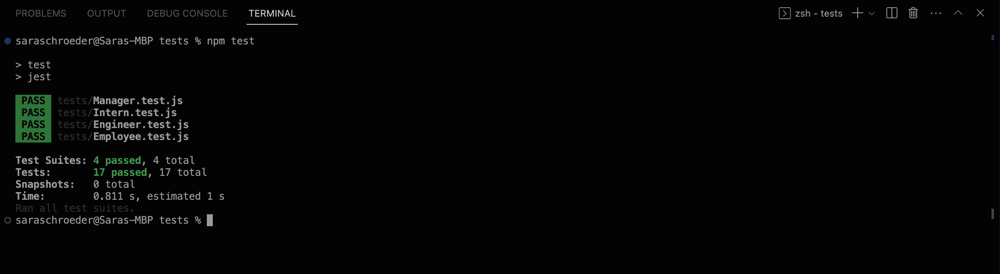

# OOP-Team-Profile-Generator

## Description

I created this application to generate a team profile based on the user input. When the user inputs information, the information will be inputted on a newly created html page along with a style sheet. 

## Installation

N/A

## Dependencies

npm i inquirer@8.2.4

## Usage

## Credits

N/A

## License

[MIT](https://choosealicense.com/licenses/mit/)